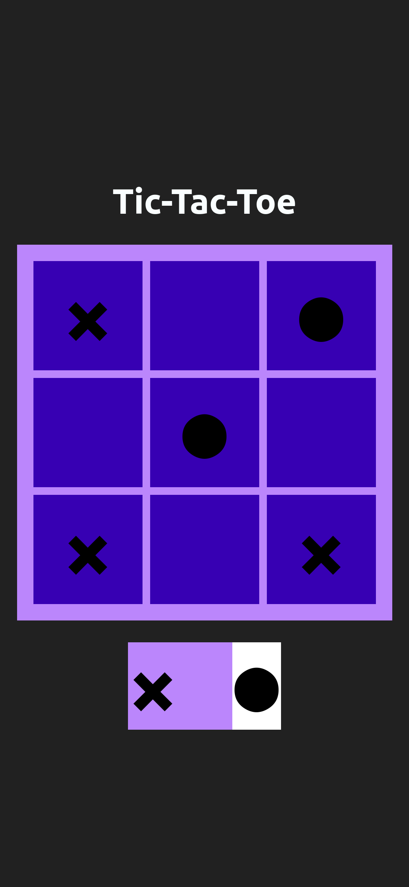

# Tic-Tac-Toe

The classic game of tic-tac-toe.

## Table of contents

- [Overview](#overview)
  - [The challenge](#the-challenge)
  - [Screenshot](#screenshot)
  - [Link](#links)
- [My process](#my-process)
  - [Built with](#built-with)

## Overview

### The challenge

Users should be able to:

- Select specific squares that will be filled with circles or Xs.
- View the current player turn in an obvious way.
- View if the game ended with a win or draw.
- Replay a new game.

### Screenshot

### Link

- Live Site URL: [https://tic-tac-toe-chicho.netlify.app/](https://tic-tac-toe-chicho.netlify.app/)

## My process

### Built with

- Semantic HTML5 markup
- Flexbox
- CSS Grid
- Mobile-first workflow
- [React](https://reactjs.org/) - JS library